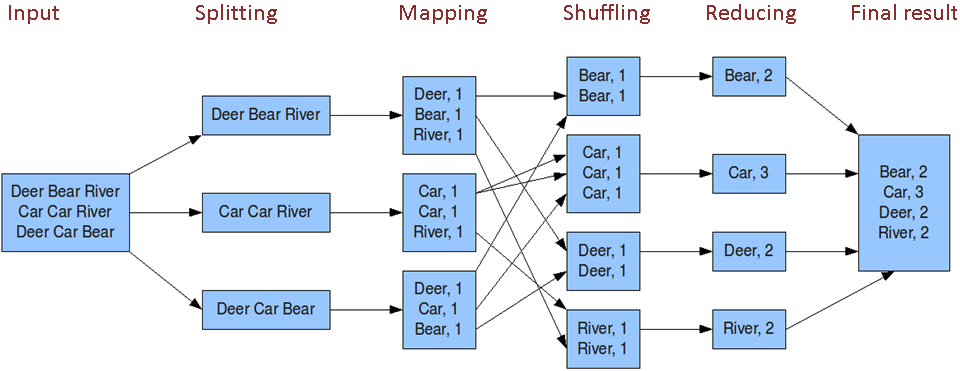
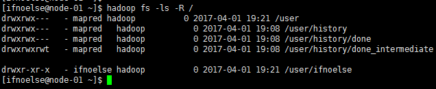
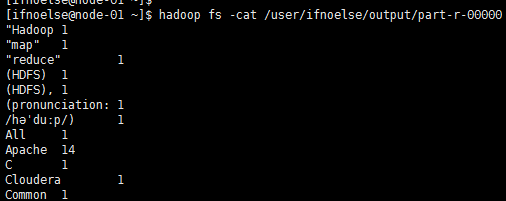

# 第一个Hadoop程序
我们来运行hadoop世界的“hello world”程序,一个用来统计单词出现次数的word count程序
## 原理

## 准备数据
创建用户目录
``` bash
sudo -u hdfs hadoop fs -mkdir /user/ifnoelse
sudo -u hdfs hadoop fs -chown ifnoelse /user/ifnoelse
```
查看此时hdfs中的目录如下：
``` bash
hadoop fs -ls -R /
```


> 如果遇到权限问题，与linux权限控制一样的，如果有权限依然不能完成操作，尝试重启hdfs

上传文本文件到hdfs测试hadoop程序,内容最好是英文
``` bash
hadoop fs -mkdir /user/ifnoelse/input
hadoop fs -put words.txt /user/ifnoelse/input
```
>words.txt为自己创建的一个文本文件

## 程序代码
``` java
package com.ifnoelse.hadoop.example;

import java.io.IOException;
import java.util.StringTokenizer;

import org.apache.hadoop.conf.Configuration;
import org.apache.hadoop.fs.Path;
import org.apache.hadoop.io.IntWritable;
import org.apache.hadoop.io.Text;
import org.apache.hadoop.mapreduce.Job;
import org.apache.hadoop.mapreduce.Mapper;
import org.apache.hadoop.mapreduce.Reducer;
import org.apache.hadoop.mapreduce.lib.input.FileInputFormat;
import org.apache.hadoop.mapreduce.lib.output.FileOutputFormat;
import org.apache.hadoop.util.GenericOptionsParser;

public class WordCount {

    public static class TokenizerMapper
            extends Mapper<Object, Text, Text, IntWritable> {

        private final static IntWritable one = new IntWritable(1);
        private Text word = new Text();

        public void map(Object key, Text value, Context context
        ) throws IOException, InterruptedException {
            StringTokenizer itr = new StringTokenizer(value.toString());
            while (itr.hasMoreTokens()) {
                word.set(itr.nextToken());
                context.write(word, one);
            }
        }
    }

    public static class IntSumReducer
            extends Reducer<Text, IntWritable, Text, IntWritable> {
        private IntWritable result = new IntWritable();

        public void reduce(Text key, Iterable<IntWritable> values,
                           Context context
        ) throws IOException, InterruptedException {
            int sum = 0;
            for (IntWritable val : values) {
                sum += val.get();
            }
            result.set(sum);
            context.write(key, result);
        }
    }

    public static void main(String[] args) throws Exception {
        Configuration conf = new Configuration();
        String[] otherArgs = new GenericOptionsParser(conf, args).getRemainingArgs();
        if (otherArgs.length < 2) {
            System.err.println("Usage: wordcount <in> [<in>...] <out>");
            System.exit(2);
        }
        Job job = Job.getInstance(conf, "word count");
        job.setJarByClass(WordCount.class);
        job.setMapperClass(TokenizerMapper.class);
        job.setCombinerClass(IntSumReducer.class);
        job.setReducerClass(IntSumReducer.class);
        job.setOutputKeyClass(Text.class);
        job.setOutputValueClass(IntWritable.class);
        for (int i = 0; i < otherArgs.length - 1; ++i) {
            FileInputFormat.addInputPath(job, new Path(otherArgs[i]));
        }
        FileOutputFormat.setOutputPath(job,
                new Path(otherArgs[otherArgs.length - 1]));
        System.exit(job.waitForCompletion(true) ? 0 : 1);
    }
}

```
项目配置及依赖的类库
``` groovy
group 'com.ifnoelse'
version '1.0'

apply plugin: 'java'

sourceCompatibility = 1.8

repositories {
    maven {
        url "http://maven.aliyun.com/nexus/content/groups/public/"
    }
}

dependencies {
    compile group: 'org.apache.hadoop', name: 'hadoop-mapreduce-client-core', version: '2.6.0'
    compile group: 'org.apache.hadoop', name: 'hadoop-common', version: '2.6.0'
}

```

## 运行第一个hadoop程序

用户自己打包的程序按以下方式执行

``` bash
hadoop jar hadoop-example-1.0.jar com.ifnoelse.hadoop.example.WordCount /user/ifnoelse/input /user/ifnoelse/output
```

>cdh自带示例
>``` bash
>hadoop jar /usr/lib/hadoop-mapreduce/hadoop-mapreduce-examples.jar wordcount /user/ifnoelse/input /user/ifnoelse/output
>```

如果集群正常的话过一会程序就会执行成功，通过以下命令查看程序执行结果
``` bash
hadoop fs -cat /user/ifnoelse/output/part-r-00000
```


## Hadoop自带的示例
通过执行
``` bash
hadoop jar /usr/lib/hadoop-mapreduce/hadoop-mapreduce-examples.jar
``` 
可以显示hadoop自带的示例程序
* aggregatewordcount: An Aggregate based map/reduce program that counts the words in the input files.
* aggregatewordhist: An Aggregate based map/reduce program that computes the histogram of the words in the input files.
* bbp: A map/reduce program that uses Bailey-Borwein-Plouffe to compute exact digits of Pi.
* dbcount: An example job that count the pageview counts from a database.
* distbbp: A map/reduce program that uses a BBP-type formula to compute exact bits of Pi.
* grep: A map/reduce program that counts the matches of a regex in the input.
* join: A job that effects a join over sorted, equally partitioned datasets
* multifilewc: A job that counts words from several files.
* pentomino: A map/reduce tile laying program to find solutions to pentomino problems.
* pi: A map/reduce program that estimates Pi using a quasi-Monte Carlo method.
* randomtextwriter: A map/reduce program that writes 10GB of random textual data per node.
* randomwriter: A map/reduce program that writes 10GB of random data per node.
* secondarysort: An example defining a secondary sort to the reduce.
* sort: A map/reduce program that sorts the data written by the random writer.
* sudoku: A sudoku solver.
* teragen: Generate data for the terasort
* terasort: Run the terasort
* teravalidate: Checking results of terasort
* wordcount: A map/reduce program that counts the words in the input files.
* wordmean: A map/reduce program that counts the average length of the words in the input files.
* wordmedian: A map/reduce program that counts the median length of the words in the input files.
* wordstandarddeviation: A map/reduce program that counts the standard deviation of the length of the words in the input files.

>注:从这里可以找到不同版本的hadoop示例程序jar
>http://mvnrepository.com/artifact/org.apache.hadoop/hadoop-mapreduce-examples