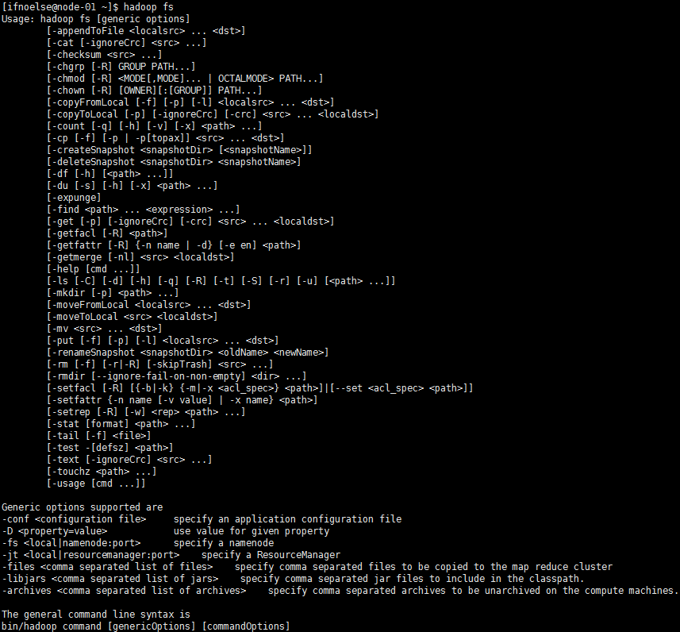
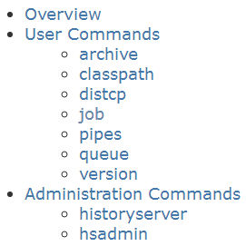
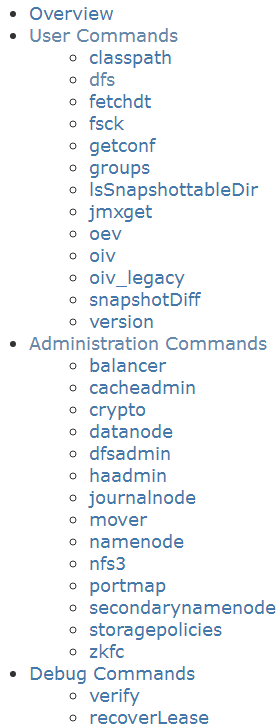

# 常用Hadoop命令

## HDFS常用命令

### 文件操作
1. 列出HDFS下的文件
```bash
hadoop fs -ls
```
2. 列出HDFS文件下名为in的文档中的文件
``` bash
hadoop fs -ls in
```
3. 上传文件，将hadoop目录下的test1文件上传到HDFS上并重命名为test：
``` bash
/usr/local/hadoop$bin/hadoop dfs -put test1 test
```
4. 文件被复制到本地系统中，将HDFS中的in文件复制到本地系统并命名为getin：
``` bash
hadoop fs -get in getin
```
5. 删除文档，删除HDFS下名为out的文档：
``` bash
hadoop fs -rm -R out
```
6. 查看文件，查看HDFS下in/test.txt文件中的内容：
``` bash
hadoop fs -cat in/test.txt
```
7. 建立目录
``` bash
hadoop fs -mkdir /user/hadoop/examples
```

8. 复制文件
``` bash
hadoop dfs -copyFromLocal 源路径 路径
```

### 管理与更新
1. 执行基本信息，查看HDFS的基本统计信息：
``` bash
hdfs dfsadmin -report
```
2. 退出安全模式，NameNode在启动时会自动进入安全模式。安全模式是NameNode的一种状态，在这个阶段，文件系统不允许有任何修改。
系统显示Name node in safe mode，说明系统正处于安全模式，这时只需要等待十几秒即可，也可通过下面的命令退出安全模式：
``` bash
hdfs dfsadmin -safemode leave
```
3. 进入安全模式，在必要情况下，可以通过以下命令把HDFS置于安全模式：
``` bash
hdfs dfsadmin -safemode enter
```
### 查看Hadoop常用hdfs命令
执行
``` bash
hadoop fs
```
查看hdfs命令行支持的命令

## 其他Hadoop命令
### [M/R命令参考](http://hadoop.apache.org/docs/r2.7.1/hadoop-mapreduce-client/hadoop-mapreduce-client-core/MapredCommands.html)



### [HDFS命令参考](http://hadoop.apache.org/docs/r2.7.1/hadoop-project-dist/hadoop-hdfs/HDFSCommands.html)

