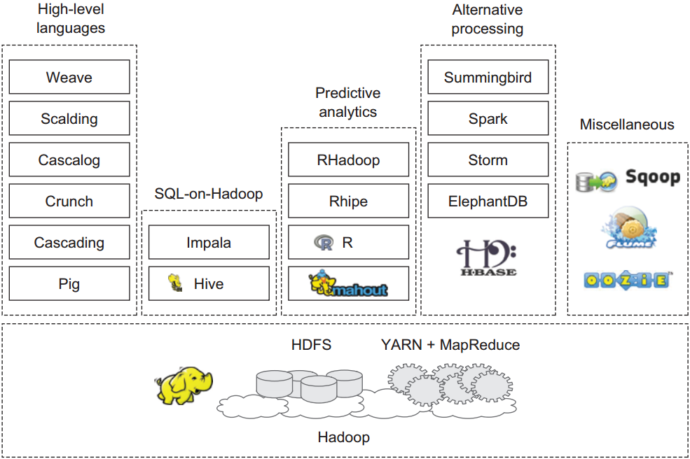

# Hadoop 生态系统
## Hadoop生态系统简图

## Hadoop常用组件

* HDFS： 如果您希望有 4000 多台电脑处理您的数据，那么最好将您的数据分发给 4000 多台电脑。HDFS 可以帮助您做到这一点。HDFS 有几个可以移动的部件。Datanodes 存储数据，Namenode 跟踪存储的位置。还有其他部件，但这些已经足以使您开始了。
* MapReduce： 这是一个面向 Hadoop 的编程模型。有两个阶段，毫不意外，它们分别被称为 Map 和 Reduce。如果希望给您的朋友留下深刻的印象，那么告诉他们，Map 和 Reduce 阶段之间有一个随机排序。JobTracker 管理您的 MapReduce 作业的 4000 多个组件。TaskTracker 从 JobTracker 接受订单。如果您喜欢 Java，那么用 Java 编写代码。如果您喜欢 SQL 或 Java 以外的其他语言，您的运气仍然不错，您可以使用一个名为 Hadoop Streaming 的实用程序。
* Hadoop Streaming：一个实用程序，在任何语言（C、Perl 和 Python、C++、Bash 等）中支持 MapReduce 代码。示例包括一个 Python 映射程序和一个 AWK 缩减程序。
* Hive 和 Hue： 如果您喜欢 SQL，您会很高兴听到您可以编写 SQL，并使用 Hive 将其转换为一个 MapReduce 作业。不，您不会得到一个完整的 ANSI-SQL 环境，但您的确得到了 4000 个注释和多 PB 级的可扩展性。Hue 为您提供了一个基于浏览器的图形界面，可以完成您的 Hive 工作。
* Pig: 一个执行 MapReduce 编码的更高层次的编程环境。Pig 语言被称为 Pig Latin。您可能会发现其命名约定有点不合常规，但是您会得到令人难以置信的性价比和高可用性。
* Sqoop：在 Hadoop 和您最喜爱的关系数据库之间提供双向数据传输。
* Oozie：管理 Hadoop 工作流。这并不能取代您的调度程序或 BPM 工具，但它在您的 Hadoop 作业中提供 if-then-else 分支和控制。
* HBase：一个超级可扩展的键值存储。它的工作原理非常像持久的散列映射（对于 Python 爱好者，可以认为是词典）。尽管其名称是 HBase，但它并不是一个关系数据库。
* FlumeNG：一个实时的加载程序，用来将数据流式传输到 Hadoop 中。它将数据存储在 HDFS 和 HBase 中。您会希望从 FlumeNG 开始，因为它对原始的水槽有所改进。
* Whirr：面向 Hadoop 的云配置。您可以在短短几分钟内使用一个很短的配置文件启动一个集群。
* Mahout：面向 Hadoop 的机器学习。用于预测分析和其他高级分析。
* Fuse：让 HDFS 系统看起来就像一个普通的文件系统，所以您可以对 HDFS 数据使用 ls、rm、cd 和其他命令。
* Zookeeper：一个分布式的，开放源码的分布式应用程序协调服务，是Google的Chubby一个开源的实现，是Hadoop和Hbase的重要组件。它是一个为分布式应用提供一致性服务的软件，提供的功能包括：配置维护、域名服务、分布式同步、组服务等。