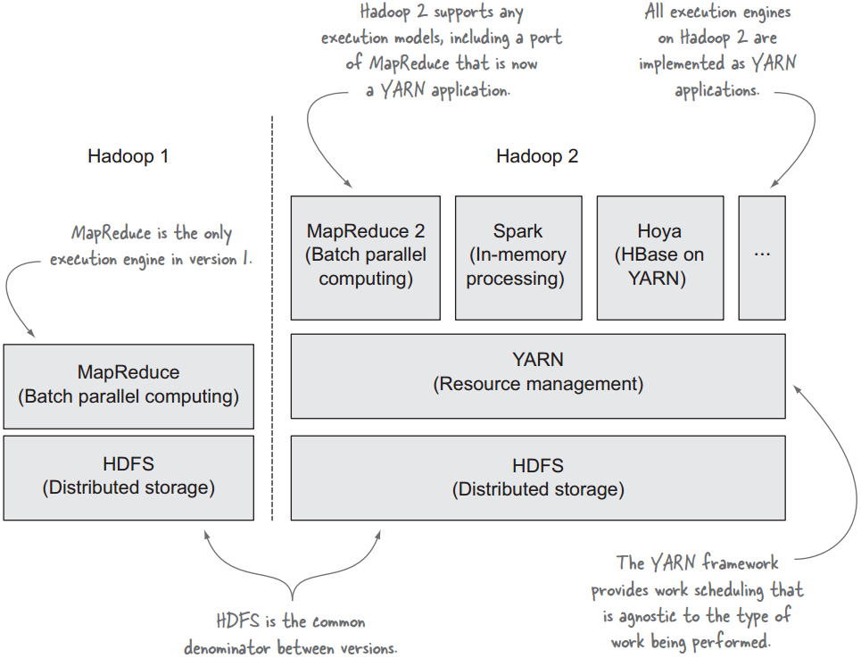
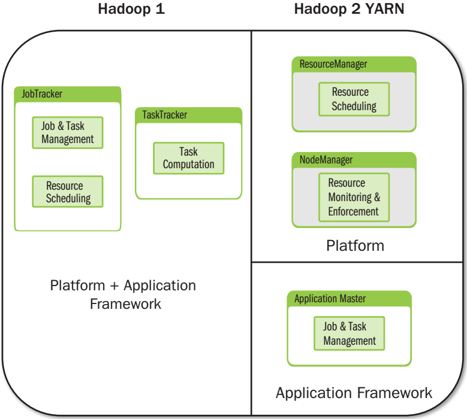
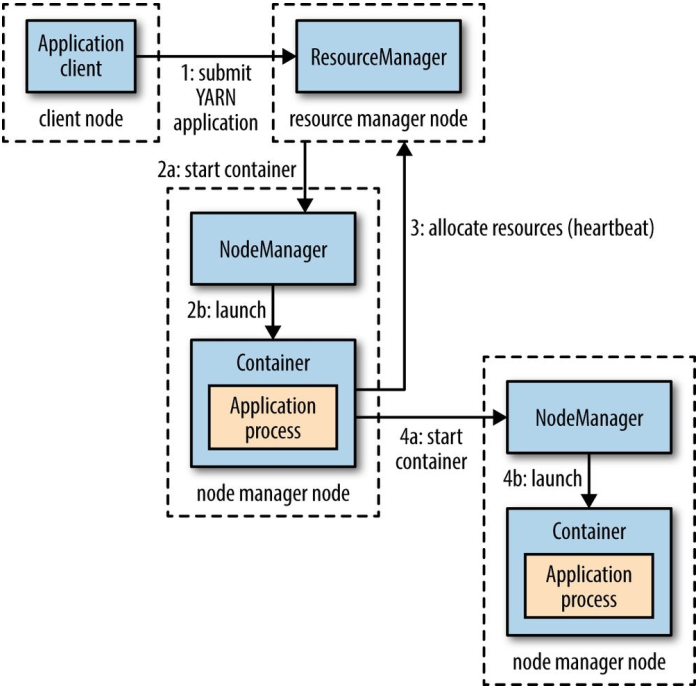

# YARN介绍
## Hadoop 1 vs Hadoop 2
### Hadoop 1 vs Hadoop 2架构图

### Hadoop 1 vs Hadoop 2组件图

* hadoop 1 中资源管理与应用框架混合在一起
* hadoop 1 中jobtracker即负责任务管理也负责资源管理
* hadoop 1 中只能运行mapreduce程序
* hadoop 2 将资源管理抽取成YARN框架
* hadoop 2 支持更多的计算模型
* hadoop 2 中任务管理由运行在YARN之上的应用程序框架自行实现
## YARN中程序执行图

