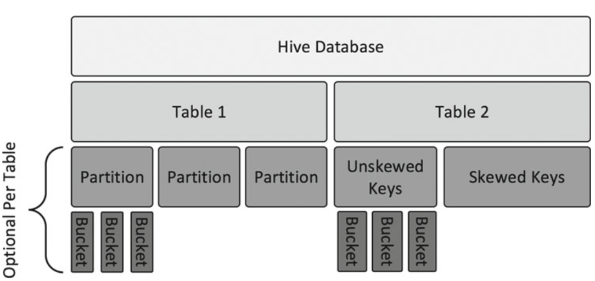

# 数据划分
## 数据模型

## 分区表
### 创建分区表
``` sql
CREATE TABLE IF NOT EXISTS tvlog 
( 
uid string, 
ch string, 
starttime string, 
endtime string 
) 
PARTITIONED BY (dt STRING)
ROW FORMAT DELIMITED 
FIELDS TERMINATED BY '\t' 
STORED AS TEXTFILE;
```
### 导入数据
``` sql
LOAD DATA LOCAL INPATH '/home/ifnoelse/tvlog' OVERWRITE INTO TABLE tvlog PARTITION(dt = "20170407");
```
### 查看数据目录

``` bash
hadoop fs -ls -h -R /user/hive
```
### 动态分区

请参考：http://lxw1234.com/archives/2015/06/286.htm

## 分桶

### 创建分桶的表
``` sql
CREATE TABLE IF NOT EXISTS tvlog 
( 
uid string, 
ch string, 
starttime string, 
endtime string 
)
PARTITIONED BY (dt STRING)
CLUSTERED BY (uid) INTO 5 BUCKETS
ROW FORMAT DELIMITED 
FIELDS TERMINATED BY '\t' 
STORED AS TEXTFILE;
```