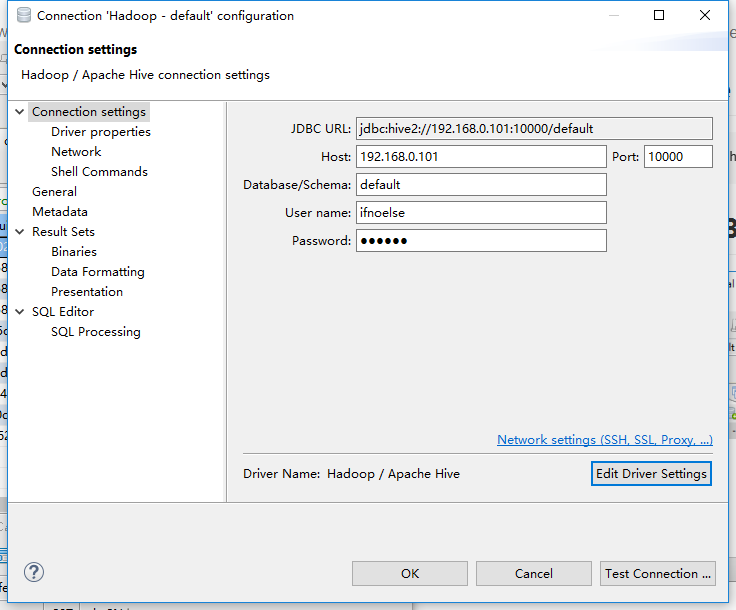
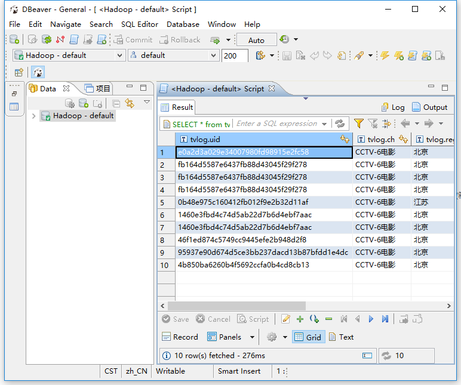

# JDBC服务
## 配置Hive JDBC
修改配置文件/etc/hive/conf/hive-site.xml增加以下内容
``` xml
<property>
   <name>hive.support.concurrency</name>
   <value>true</value>
</property>
<property>
   <name>hive.zookeeper.quorum</name>
   <value>node-01</value>
</property>
<property>
   <name>hive.server2.thrift.min.worker.threads</name>
   <value>5</value>
</property>
<property>
   <name>hive.server2.thrift.max.worker.threads</name>
   <value>100</value>
</property>
<property>  
   <name>hive.server2.authentication</name>  
   <value>CUSTOM</value>  
</property>  
<property>  
   <name>hive.server2.custom.authentication.class</name>  
   <value>tv.huan.hive.auth.HuanPasswdAuthenticationProvider</value>  
</property>  
<property>  
   <name>hive.server2.custom.authentication.file</name>  
   <value>/usr/lib/hive/conf/user.password.conf</value>  
</property>
```
## 配置JDBC密码
``` bash
sudo vim /usr/lib/hive/conf/user.password.conf
```
添加以下内容
ifnoelse,密码的32位md5指
>示例：ifnoelse,e10adc3949ba59abbe56e057f20f883e

## 启动Hive Server2
``` bash
sudo service hive-server2 start
```

## Hive JDBC客户端
### 客户端下载地址
http://dbeaver.jkiss.org/
### JDBC config

### JDBC 使用示例
