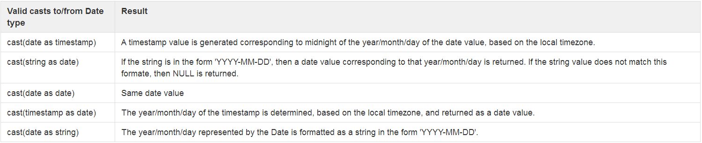
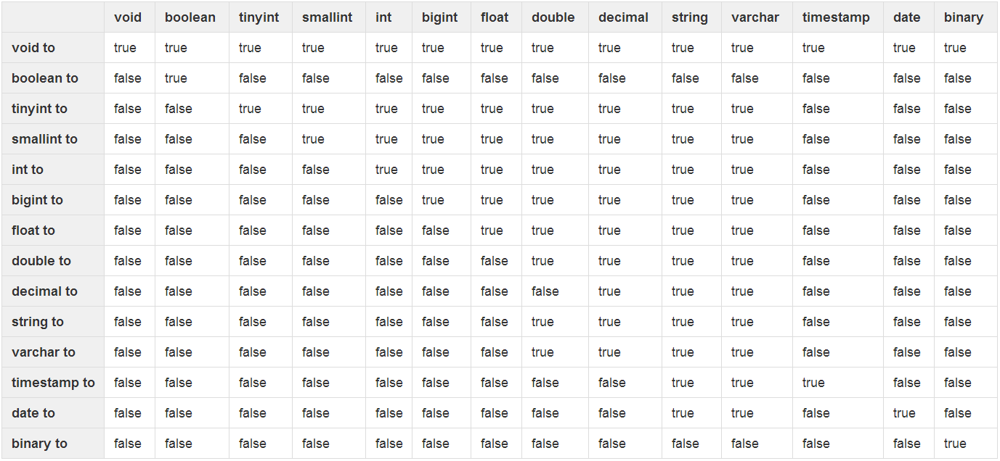

# 隐式转换
## 数据转换


## 数据类型隐式转换表



## 此处有坑

测试数据

``` text
01	一月
02	二月
03	三月
04	四月
05	五月
06	六月
07	七月
08	八月
09	九月
10	十月
11	十一月
12	十二月
```

创建表并加载数据

``` sql
CREATE TABLE IF NOT EXISTS month 
( 
num string, 
name string
) 
ROW FORMAT DELIMITED 
FIELDS TERMINATED BY '\t';
```

加载数据

``` sql
LOAD DATA LOCAL INPATH 'month' OVERWRITE INTO TABLE month;
```

**到底谁转换成了谁**

``` sql
select * from month where num=3;
select * from month where "3"=3;
select * from month where "03"=3;
select * from month where "3"=cast(3 as string);
select * from month where "03"=cast(3 as int);
select * from month where "03"=cast(3 as string);
```
由以下结果猜想，上边的问题应该是等号左右的比较对象都转成了double
``` sql
hive> select "03"+3;
OK
6.0
Time taken: 0.065 seconds, Fetched: 1 row(s)
```
