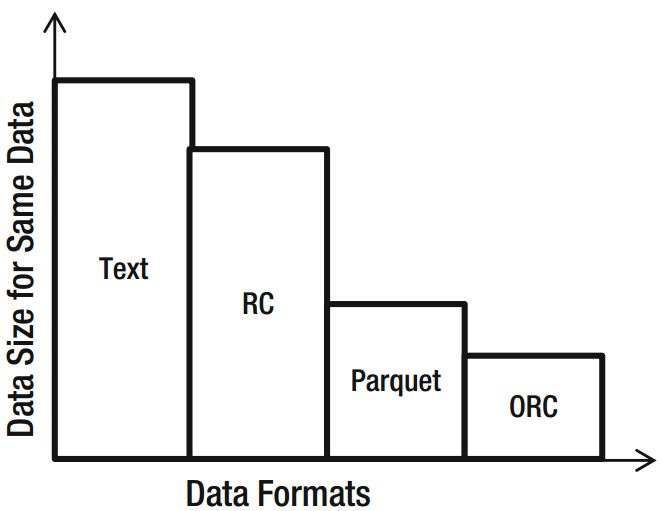
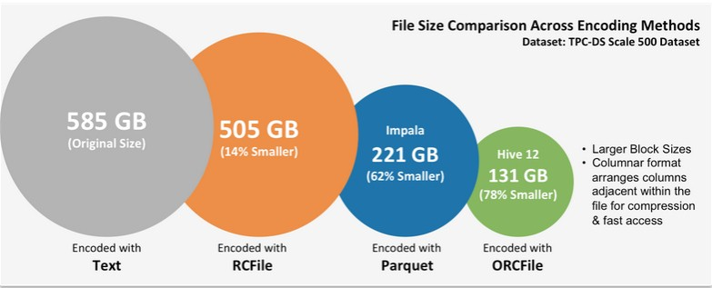

# 存储格式
## 存储空间
### 基本规律

### 实际示例

## 文件格式

### Text/CSV Files
Comma-separated values (CSV) files do not support block compression, thus
compressing a CSV file in Hadoop often comes at a significant read-performance cost.
When working with Text/CSV files in Hadoop, never include header or footer lines. Each
line of the file should contain a record. This means that there is no metadata stored
with the CSV file. One must know how the file was written in order to make use of it. File
structure is dependent on field order: new fields can only be appended at the end of
records, while existing fields can never be deleted. As such, CSV files have limited support
for schema evolution.

### JSON Records
JSON records are different from JSON files in that each line is its own JSON datum,
making the files splittable. Unlike CSV files, JSON stores metadata with the data, fully
enabling schema evolution. However, as with CSV files, JSON files do not support block
compression. Third-party JSON SerDe are frequently available and often solve these challenges.

### Avro Format
Avro is quickly becoming the best multipurpose storage format within Hadoop. Avro
format stores metadata with the data and also allows for specifying an independent
schema for reading the file. Avro is the epitome of schema evolution support, because one
can rename, add, delete, and change the data types of fields by defining new independent
schema. Avro files are also splittable and support block compression.

### Sequence Files
Sequence files store data in a binary format with a structure similar to CSV. Sequence files
do not store metadata with the data, so the only schema evolution option is to append
new fields. Sequence files do support block compression. Owing to the complexity of
reading sequence files, they are often used only for “in flight” data, such as intermediate
data storage used within a sequence of MapReduce jobs.

### RC Files
Record Columnar (RC) files were the first columnar file format in Hadoop. The RC file
format provides significant compression and query-performance benefits. RC files
in Hive, however, do not support schema evolution. Writing an RC file requires more
memory and computation than non-columnar file formats, and writes are generally slow.

### ORC Files
Optimized RC files were invented to optimize performance in Hive and are primarily
backed by Hortonworks. ORC files, however, compress better than RC files, enabling
faster queries. They don’t support schema evolution.

### Parquet Files
As with RC and ORC, the Parquet format also allows compression and improved queryperformance benefits and is generally slower to write. Unlike RC and ORC files, Parquet
supports limited schema evolution. New columns can be added to an existing Parquet
format. Parquet is supported by Cloudera and is optimized for Cloudera Impala. Native
Parquet support is rapidly being added for the rest of the Hadoop and Spark ecosystem.

## How to Choose a File Format?
Each file format is optimized by some goal. Choice of format is driven by use case,
environment, and workload. Some factors to consider in deciding file format include the
following:
* **Hadoop Distribution:** Note that Cloudera and Hortonworks
support/favor different formats.
* **Schema Evolution:** Consider whether the structure of data evolves
over time.
* **Processing Requirements:** Consider the processing load of the data
and the tools to be used in processing.
* **Read/Write Requirements:** What are the read/write patterns, is it
read-only, read-write, or write-only.
* **Exporting/Extraction Requirements:** Will the data be extracted
from Hadoop for import into an external database engine or other
platform?
* **Storage Requirements:** Is data volume a significant factor?
Will you get significantly more bang for your storage through
compression?

If you are storing intermediate data between MapReduce jobs, Sequence files are
preferred. If query performance is most important, ORC (Hortonworks/Hive) or Parquet
(Cloudera/Impala) are optimal, but note that these files take longer to create and cannot
be updated.
Avro is the right choice if schema is going to change over time, but query
performance will be slower than with ORC or Parquet. CSV files are excellent when
extracting data from Hadoop to load into a database.