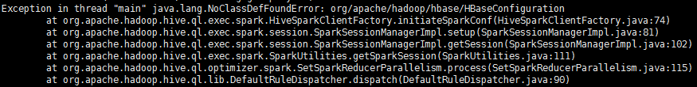

# Hive on Spark

## Spark 安装
执行以下命令安装相关组件
``` shell
sudo yum install spark-core spark-history-server spark-python
```
链接配置文件
``` shell
sudo ln -s /etc/hadoop/conf.my_cluster/hdfs-site.xml /etc/spark/conf/hdfs-site.xml
sudo ln -s /etc/hadoop/conf.my_cluster/core-site.xml /etc/spark/conf/core-site.xml
sudo ln -s /etc/hive/conf/hive-site.xml /etc/spark/conf/hive-site.xml
```
修改环境变量，在文件/etc/spark/conf/spark-env.sh中增加以下内容
``` shell
export HIVE_HOME=/usr/lib/hive
export HADOOP_HOME=/usr/lib/hadoop
export HADOOP_CONF_DIR=/etc/hadoop/conf
```
**运行第一个spark程序**

build.sbt
```
name := "spark-example"

version := "1.0"

scalaVersion := "2.10.6"

libraryDependencies ++= Seq(
  "org.apache.spark" % "spark-core_2.10" % "1.6.0",
  "org.apache.spark" % "spark-sql_2.10" % "1.6.0",
  "org.apache.spark" % "spark-hive_2.10" % "1.6.0"
)
```
spark程序代码
``` scala
package com.ifnoelse.spark

import org.apache.spark.{SparkConf, SparkContext}

object SparkTest {
  def main(args: Array[String]) {
    val sc = new SparkContext("yarn-cluster", "test", new SparkConf())
    val url = "hdfs://node-01:8020/user/ifnoelse/input/words.txt"
    val rdd = sc.textFile(url)
    val m = rdd.flatMap(_.split(" ")).map(w => (w, 1)).reduceByKey((a, b) => a + b)
    m.sortBy(x => x._2, ascending = false).foreach(println)
  }
}
```
将以上程序打成jar包通过以下命令执行
``` shell
spark-submit --deploy-mode cluster --master yarn-cluster --class com.ifnoelse.spark.SparkTest --driver-cores 1 --driver-memory 2G --executor-memory 2G --num-executors 1 ~/spark-example_2.10-1.0.jar
```
执行完成之后通过以下命令查看执行结果
``` shell
yarn logs -applicationId application_1490174666700_0003
```

## 配置Hive环境

### 方法一
hive命令行执行
```bash
hive> set hive.execution.engine=spark;
```
### 方法二

``` xml
<property>
 <name>hive.execution.engine</name>
 <value>spark</value>
</property>
```

### 错误处理
如果遇到以下错误，请按照Hbase
