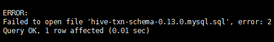

# 安装及配置Hive
## hive安装
``` bash
sudo yum install hive hive-metastore hive-server2
```
## 初始化hive元数据库
创建元数据库
``` bash
$ mysql -u root -p
Enter password:
mysql> CREATE DATABASE metastore;
mysql> USE metastore;
mysql> SOURCE /usr/lib/hive/scripts/metastore/upgrade/mysql/hive-schema-1.1.0.mysql.sql
```
在mysql中创建hive用户
``` bash
$ mysql -u root -p
Enter password:
mysql> CREATE USER 'hive'@'localhost' IDENTIFIED BY 'user_hive_passwd';
mysql> GRANT ALL ON metastore.* TO  'hive'@'%' IDENTIFIED BY 'user_hive_passwd';
```
如果遇到如下错误



修改sql脚本
sudo vim /usr/lib/hive/scripts/metastore/upgrade/mysql/hive-schema-1.1.0.mysql.sql
``` bash
SOURCE hive-txn-schema-0.13.0.mysql.sql;
```
修改成
```
SOURCE /usr/lib/hive/scripts/metastore/upgrade/mysql/hive-txn-schema-0.13.0.mysql.sql;
```
然后删掉数据库再重新运行一下元数据初始过程

## 配置hive
下载mysql jdbc驱动：[mysql-connector-java-5.1.41.jar](http://central.maven.org/maven2/mysql/mysql-connector-java/5.1.41/mysql-connector-java-5.1.41.jar)
<br />将mysql驱动放到/usr/lib/hive/lib下
<br />修改/etc/hive/conf/hive-site.xml配置如下
``` xml
<?xml version="1.0"?>

<?xml-stylesheet type="text/xsl" href="configuration.xsl"?>

<configuration>

<property>
  <name>javax.jdo.option.ConnectionURL</name>
  <value>jdbc:mysql://node-01/metastore</value>
  <description>the URL of the MySQL database</description>
</property>

<property>
  <name>javax.jdo.option.ConnectionDriverName</name>
  <value>com.mysql.jdbc.Driver</value>
</property>

<property>
  <name>javax.jdo.option.ConnectionUserName</name>
  <value>hive</value>
</property>

<property>
  <name>javax.jdo.option.ConnectionPassword</name>
  <value>user_hive_passwd</value>
</property>

<property>
  <name>datanucleus.autoCreateSchema</name>
  <value>false</value>
</property>

<property>
  <name>datanucleus.fixedDatastore</name>
  <value>true</value>
</property>

<property>
  <name>datanucleus.autoStartMechanism</name> 
  <value>SchemaTable</value>
</property> 

<property>
  <name>hive.metastore.uris</name>
  <value>thrift://node-01:9083</value>
  <description>IP address (or fully-qualified domain name) and port of the metastore host</description>
</property>

<property>
  <name>hive.metastore.schema.verification</name>
  <value>false</value>
</property>

<property>
 <name>hive.metastore.warehouse.dir</name>
 <value>/usr/hive/warehouse</value>
</property>

<property>
<name>hive.exec.scratchdir</name>
<value>/usr/hive/tmp</value>
</property>

<property>
<name>hive.querylog.location</name>
<value>/usr/hive/log</value>
</property>

</configuration>
```
启动 hive-metastore
``` shell
sudo service hive-metastore start
```
如果不能正常启动请查看相关日志，路径/var/log/hive/hive-metastore.log