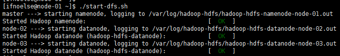
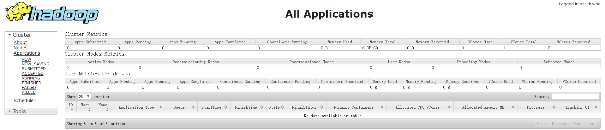

# 启动Hadoop

## 启动HDFS
### 格式化namenode
``` bash
sudo -u hdfs hdfs namenode -format
```
启动hdfs,将以下脚本保存到start-dfs.sh里然后运行
``` bash
#!/usr/bin/env bash

echo -n "master ---> "
for x in `cd /etc/init.d ; ls hadoop-hdfs-*` ; do sudo service $x start ; done

for i in {2..3}
do
    echo -n "node-0$i ---> "
    ssh -qt ifnoelse@node-0$i 'for x in `cd /etc/init.d ; ls hadoop-hdfs-*` ; do sudo service $x start ; done'
done
```


停止hdfs脚本，将以下内存保存在stop-dfs.sh用于关闭hdfs
``` bash
#!/usr/bin/env bash

echo -n "master ---> "
for x in `cd /etc/init.d ; ls hadoop-hdfs-*` ; do sudo service $x stop ; done

for i in {2..3}
do
    echo -n "node-0$i ---> "
    ssh -qt ifnoelse@node-0$i 'for x in `cd /etc/init.d ; ls hadoop-hdfs-*` ; do sudo service $x stop ; done'
done
```
### 初始化HDFS中的相关目录
执行以下命令完成相关目录创建
``` bash
sudo -u hdfs hadoop fs -mkdir /tmp
sudo -u hdfs hadoop fs -chmod -R 1777 /tmp
sudo -u hdfs hadoop fs -mkdir -p /user/history
sudo -u hdfs hadoop fs -chmod -R 1777 /user/history
sudo -u hdfs hadoop fs -chown mapred:hadoop /user/history
sudo -u hdfs hadoop fs -mkdir -p /var/log/hadoop-yarn
sudo -u hdfs hadoop fs -chown yarn:mapred /var/log/hadoop-yarn
sudo -u hdfs hadoop fs -ls -R /
```

## 启动yarn
将以下脚本保存到start-yarn.sh
然后执行
``` bash
#!/usr/bin/env bash

echo -n "master ---> "
sudo service hadoop-yarn-resourcemanager start
sudo service hadoop-mapreduce-historyserver start

for i in {2..3}
do
    echo -n "node-0$i ---> "
    ssh -qt ifnoelse@node-0$i 'sudo service hadoop-yarn-nodemanager start'
done
```
停止yarn脚本，将以下内容保存在stop-yarn.sh中，用于关闭yarn
``` bash
#!/usr/bin/env bash

echo -n "master ---> "
sudo service hadoop-yarn-resourcemanager stop
sudo service hadoop-mapreduce-historyserver stop

for i in {2..3}
do
    echo -n "node-0$i ---> "
    ssh -qt ifnoelse@node-0$i 'sudo service hadoop-yarn-nodemanager stop'
done
```
## Hadoop控制台
hdfs与yarn正常启动之后通过以下地址可以访问hadoop控制台
http://master:8088/cluster

