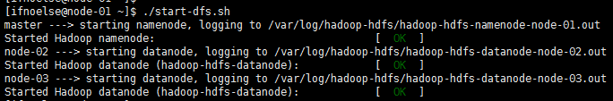
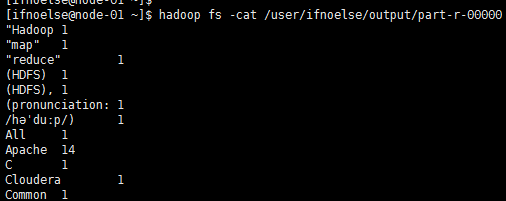

#启动Hadoop

## 启动HDFS
### 格式化namenode
``` bash
sudo -u hdfs hdfs namenode -format
```
### 启动hdfs
将以下脚本保存到start-dfs.sh里然后运行
``` bash
#!/usr/bin/env bash

echo -n "master ---> "
for x in `cd /etc/init.d ; ls hadoop-hdfs-*` ; do sudo service $x start ; done

for i in {2..3}
do
    echo -n "node-0$i ---> "
    ssh -qt ifnoelse@node-0$i 'for x in `cd /etc/init.d ; ls hadoop-hdfs-*` ; do sudo service $x start ; done'
done
```


停止hdfs脚本
``` bash
#!/usr/bin/env bash

echo -n "master ---> "
for x in `cd /etc/init.d ; ls hadoop-hdfs-*` ; do sudo service $x stop ; done

for i in {2..3}
do
    echo -n "node-0$i ---> "
    ssh -qt ifnoelse@node-0$i 'for x in `cd /etc/init.d ; ls hadoop-hdfs-*` ; do sudo service $x stop ; done'
done

```
### 初始化HDFS中的相关目录
执行以下命令完成相关目录创建
``` bash
sudo -u hdfs hadoop fs -mkdir /tmp
sudo -u hdfs hadoop fs -chmod -R 1777 /tmp
sudo -u hdfs hadoop fs -mkdir -p /user/history
sudo -u hdfs hadoop fs -chmod -R 1777 /user/history
sudo -u hdfs hadoop fs -chown mapred:hadoop /user/history
sudo -u hdfs hadoop fs -mkdir -p /var/log/hadoop-yarn
sudo -u hdfs hadoop fs -chown yarn:mapred /var/log/hadoop-yarn
sudo -u hdfs hadoop fs -ls -R /
```

## 启动yarn
将以下脚本保存到start-yarn.sh
然后执行
``` bash
#!/usr/bin/env bash

echo -n "master ---> "
sudo service hadoop-yarn-resourcemanager start
sudo service hadoop-mapreduce-historyserver start

for i in {2..3}
do
    echo -n "node-0$i ---> "
    ssh -qt ifnoelse@node-0$i 'sudo service hadoop-yarn-nodemanager start'
done
```
停止yarn脚本 stop-yarn.sh
``` bash
#!/usr/bin/env bash

echo -n "master ---> "
sudo service hadoop-yarn-resourcemanager stop
sudo service hadoop-mapreduce-historyserver stop

for i in {2..3}
do
    echo -n "node-0$i ---> "
    ssh -qt ifnoelse@node-0$i 'sudo service hadoop-yarn-nodemanager stop'
done

```

## 运行第一个hadoop程序
### 创建用户目录
``` bash
sudo -u hdfs hadoop fs -mkdir /user/ifnoelse
sudo -u hdfs hadoop fs -chown ifnoelse /user/ifnoelse
```
### 上传测试文件到hdfs
上传文本文件到hdfs测试hadoop程序,内容最好是英文
``` bash
hadoop fs -mkdir /user/ifnoelse/input
hadoop fs -put words.txt /user/ifnoelse/input
```
> 如果遇到权限问题，与linux权限控制一样的，如果有权限依然不能完成操作，尝试重启hdfs
### 运行wordcount程序
``` bash
hadoop jar /usr/lib/hadoop-mapreduce/hadoop-mapreduce-examples.jar wordcount /user/ifnoelse/input /user/ifnoelse/output
```
如果集群正常的话过一会程序就会执行成功，通过以下命令查看程序执行结果
``` bash
hadoop fs -cat /user/ifnoelse/output/part-r-00000
```

