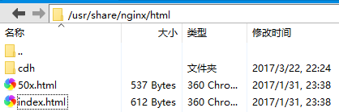

# 配置本地yum源
由于cdh的在线yum源网络情况太差，所以最好选择配置本地源进行安装，这样可以节省大量时间
## 下载相关离线yum软件包
http://archive.cloudera.com/cdh5/repo-as-tarball/
> 比如cdh5.10安装包cdh5.10.0-centos7.tar.gz就可以了

## 安装nginx
[nginx安装方法]([http://nginx.org/en/linux_packages.html])

## 配置nginx做为yum本地源
将刚才下载的cdh软件包解压到/usr/share/nginx/html/


修改cdh/cloudera-cdh5.repo
```
[cloudera-cdh5]
# Packages for Cloudera's Distribution for Hadoop, Version 5, on RedHat    or CentOS 7 x86_64
name=Cloudera's Distribution for Hadoop, Version 5
baseurl=http://node-01/cdh/5/
gpgkey = http://node-01/cdh/RPM-GPG-KEY-cloudera
gpgcheck = 1
```
启动nginx
```
nginx
```

在各个节点上配置本地yum源
```
wget http://node-01/cdh/cloudera-cdh5.repo
cp cloudera-cdh5.repo /etc/yum.repos.d/
```
> node-01为nginx安装的节点计算机名